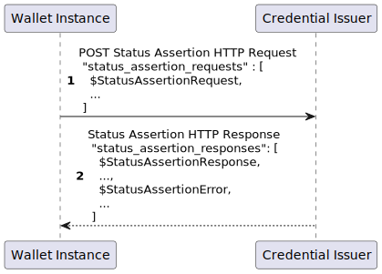

.. include:: ../common/common_definitions.rst

Digital Credential Revocation and Suspension
============================================

This section describes the flows to request a Digital Credential status update (i.e. revocation or suspension), involved entities, and validation mechanisms for Digital Credentials in the IT-Wallet system.

As highlighted in Section :ref:`Wallet Instance and Digital Credential Lifecycle <Wallet Instance and Digital Credential Lifecycle>`, a Digital Credential's lifecycle is affected by:

  - The lifecycle of its storing Wallet Instance
  - The validity of Attributes managed by Authentic Sources
  - For PIDs only, the status of the Digital Identity used for User authentication

External user-related factors can also influence a Digital Credential's lifecycle, such as:

  - Explicit request from the Digital Credential holder
  - User's death
  - Illegal activities

Entities involved
-----------------

While the Credential Issuer MUST directly manage the validity status of Digital Credentials it has issued, other actors MAY trigger the Digital Credential revocation/suspension process:

  - Users, through:
      - Their Wallet Instance
      - Web service provided by the Issuer
  - The Authentic Source when Credential attributes are updated or change validity status
  - The Wallet Provider when revoking a Wallet Instance
  - The Identity Provider if the Digital Identity used for PID issuance is stolen or compromised
  - Legal authorities or the Supervisory Body in cases of proven illegal activities

The following figure shows an entity relationships diagram relating to the Update Flow status.

.. _fig_entity-relation-credential-revocation:
.. figure:: ../../images/entity-involved-credential-revocation.svg
    :figwidth: 100%
    :align: center
    :target: https://www.plantuml.com/plantuml/svg/RPFFRjGm4CRlUOfXBsmasbmuSIhTHc8HXLMt5U8KUMEpjN3io1xl4X3lpjXrcYZUI9NhgUVxVlEdDmwPHT-fedWZTQiy5_2CsBiFLMNP-VeeyTaVl1EsDHg5nklMT5Mlc0v9LmwvaeTgy_vg5q9Fzr-gZZaKbaBDndIzqI6dZmQVjdTrit-i7-flZpzszReiYfsmpkXrq7y7goSwLdJM6YKEOCvQwYDmIH1CGMi59p79b5jHwgtncZCxhCzCAO6D6yYte-plyGxxU5-LyBS0-bvXnlTIEsIw5LF6DaK2GlYvPveTXOD0zzR1NUBOp3akQ_VMd2IdcaRfNGgCqkdkO64DJ7CuYmEGvKcs8ZZyAuh9W7by3kPjuuotaVxZ689z36KUeQt04AqyUAGx6g0Cs3hdXOsENQeqX4zCIHxQJqJe2M1oR-hVBmJ6oZ-2DmV3XmWmHY1EJWetCknz7mfnnWwtyV5dpsKhcOAKX1JRSX47FdMfd9Si8oU9JOrFxADBlBbP9PU65V-S1kEMFPxPfNLhfdKZXrnkzDuOZKngDszmSChRM1GFGgLLN-u9h1x4oVmIi5p5SfQKB-wTe82OKytVXyRDjIyKKRv0PJYvrMK-bmoNxoVlhmRbp-7IF7Y0bqO7YPmXarXQWoMYbYM5897zSsGQyo7vdhDmhcbIdavZbpCh4rcsyKlLBO4TmqwtA4zn_qUYz3BVgTUELdllUg5vo0ZV3VtkE_KV
    
    Entities involved in Credential Revocation Flow

Status Update Flows
-------------------

This section describes the main flows for managing Digital Credential Status Updates by the Issuer, in particular Status Update:

  - related to the User;
  - triggered by a Wallet Instance;
  - triggered by a Wallet Provider;
  - triggered by an Authentic Source.

.. note:: 
  Detailed Status Update Flows for Identity Providers, legal authorities, and the Supervisory Body will be covered in future versions of the technical specification.

Status Update related to the User
+++++++++++++++++++++++++++++++++

Users MAY change their Digital Credential validity status by:

  1. Deleting the Digital Credential from their Wallet Instance: the Wallet Instance MUST use the Notification Endpoint provided by the Issuer as described in Section :ref:`Status Update by Wallet Instance <Status Update by Wallet Instance>`.
  2. Using the Issuer's web portal:

    a. Users MAY access a secure area with at least the same Level of Assurance used during the issuance phase.
    b. The Issuer MUST allow Users to:

      - View all their Digital Credentials contained in the Issuer's database.
      - Verify data authenticity.
      - View and update validity status (revoke their Digital Credentials and, if it is supported by the Issuer, suspend them).

.. note:: 
  If the User activates another Wallet Instance from the same Wallet Provider and using the same Wallet Solution and obtains a new PID, the previous PID MUST be revoked, and the previous Wallet Instance MUST transition to operational status.

In case of the death of the User, Issuers and Wallet Provider MUST ensure that Digital Credentials and Wallet Instances owned by the User are revoked. 
The User's death triggers a change in the validity status of the User's identification attributes contained in the public registry (ANPR). The User's death MUST produce the PID revocation. Therefore, the Authentic Source of the PID (ANPR) MUST notify the PID Provider that the User's attributes are no longer valid due to the death of the User. The Authentic Source and the PID Provider MUST use the mechanisms provided in the Section :ref:`Status Update by Authentic Sources <Status Update by Authentic Sources>`.

.. note:: 
  Future versions of this technical specification will define how the information to (Q)EAA Issuers and Wallet Providers are propagated, according to national regulation. Moreover, automated procedures for Credential revocation due to illegal activities will be defined in future specifications.

Status Update by Wallet Instance
++++++++++++++++++++++++++++++++

When the User deletes a Digital Credential from the Wallet Instance, the Wallet Instance MUST notify this event to the Credential Issuer and the Credential Issuer MUST revoke the Digital Credential. To notify this event, the Wallet Instance MUST use the *Notification Endpoint* described in Section :ref:`Notification Endpoint <Notification endpoint>` using the parameter ``event`` set with the value ``credential_deleted``. 

When the revoked Credential is the PID, the Credential Issuer MUST send a notification of this event to the User within 24 hours.
For any other Credential different from the PID, the Credential Issuer SHOULD send a notification of this event to the User. The notification to the User might be implemented in several ways, such as using a User's email address, telephone number, or any other verified and secure communication channel, and MUST include all the information about the Credential revocation status. The method used for the notification to the User is out of scope of the current technical implementation profile. When the revocation occurs, the Credential Issuer MUST update the status of the Digital Credential accordingly. When the Notification Response sent by the Credential Issuer is succesfully received by the Wallet Instance, the Wallet Instance MUST delete the Digital Credential.  

Status Update by Wallet Providers 
+++++++++++++++++++++++++++++++++

In addition to what already defined in :ref:`Wallet Instance and Digital Credential Lifecycle <Wallet Instance and Digital Credential Lifecycle>`, the Credential Issuer MUST provide a web service (Wallet Instance Revocation endpoint) defined using PDND, as specified in the Section :ref:`e-Service PDND Catalogue <e-Service PDND Catalogue>`.
The Wallet Provider that for any reason revokes a Wallet Instance MUST send a notification to Issuers using this endpoint.

Status Update by Authentic Sources
++++++++++++++++++++++++++++++++++

Authentic Sources manage attributes separately from Digital Credentials, which verify authenticity like physical documents. Losing a physical document doesn't mean losing the privileges it represents; it just means the User can't prove them. However, if a User loses privileges due to a serious infraction, the Authentic Source will revoke the related attributes. In such cases, when a User's attributes are updated, Authentic Sources MUST notify Credential Issuers to update the validity status of any Digital Credential containing those attributes.

Credential Issuers MUST provide a web service available via PDND for Credential update notification and validity status as defined in Section :ref:`e-Service PDND Catalogue <e-Service PDND Catalogue>`. For the protocol flow, please refer to the Section :ref:`e-Service PDND <e-Service PDND>`.
Authentic Sources MUST use this notification service in the following cases:

  - The value of one or more Attributes contained in the Authentic Source's database has changed.
  - The validity status of the Attributes is updated (revocation or suspension).

Validity Verification Mechanisms 
--------------------------------

The verification of the validity of a Digital Credential is based on the OAuth Status Assertions Specification (`OAUTH-STATUS-ASSERTION`_) with slight modifications [#]_.

A Status Assertion is a signed document serving as proof of a Digital Credential's current validity status. The Credential Issuer provides these assertions to Holders who can present them to Verifiers together with the corresponding Digital Credentials.

The Status Assertions have the following features:

  - automated issuance, as the User authentication is not required for the provisioning of the Status Assertion;
  - verification of the Digital Credential validity status in both online and offline scenarios;
  - privacy-preserving, according to the following evidences:
    
    - the Verifier can check the validity of the Credential during the presentation phase. It is not able to check the validity of a given Digital Credential related to the User over time and out of the scope of the User authentication;
    - the Credential Issuers is not able to know to which Verifier the Digital Credential or the Status Assertion will be presented;
    - it doesn't reveal any information about the Users or the content of their Digital Credentials.
  
  - MUST have a validity period not greater than 24 hours.

.. note::
  .. [#] This specification only support JWT format and the Status Assertion uses ``credential_status_type`` claim instead of ``credential_status_validity``.

The following sections describe how the Digital Credential validation mechanism works through its key phases. 

Flow during issuance
++++++++++++++++++++

Credential Issuers, once a Digital Credential has been generated and successfully issued, MUST:

  - Store it locally with minimum set of data required to manage its lifecycle, including the validity status of that Digital Credential;
  - Include a specified hash algorithm in the Digital Credential using the ``credential_hash_alg`` claim within the ``status_assertion`` JSON member of the status claim

Moreover, Credential Issuers MUST add the following parameters within their Metadata:

  - ``status_assertion_endpoint``
  - ``credential_hash_alg_supported``

Flow for status refresh
+++++++++++++++++++++++

A Wallet Instance MUST check periodically the validity status of the Digital Credential that is stored in it, requesting a Status Assertion for each Digital Credential. In this case, the Wallet Instance MUST send a *Status Assertion Request* to the Credential Issuer according to "OAuth Status Assertion Specification" (see `OAUTH-STATUS-ASSERTION`_ for more details) and it is depicted in the following diagram.

.. _fig_entity-relation-credential-revocation-2:
TaujhcjdukhTtCIULNjT_hPZkPGk_m80
    
    Status Assertion Flow

**Step 1 (Status Assertion Request)**: The Wallet Instance sends the Status Assertion Request to the Credential Issuer, where:

  - The request MUST contain the base64url encoded hash value of the Digital Credential, for which the Status Assertion is requested, and enveloped in a signed Status Assertion Request object.
  - The Status Assertion Request object MUST be signed with the private key corresponding to the confirmation claim assigned by the Issuer and contained within the Digital Credential.

The Status Assertion HTTP request can be sent to a single Credential Issuer regarding multiple Digital Credentials, and MUST contain a JSON object with the member `status_assertion_requests` as described in Section :ref:`HTTP Status Assertion Request <HTTP Status Assertion Request>`.

The Credential Issuer that receives the Status Assertion Request object MUST:

  - validate that the Wallet Instance making the request is authorized to request Status Assertions. If errors occur during this check, the Credential Issuer MUST provide a Status Assertion Error Response according to Section :ref:`HTTP Status Assertion Response <HTTP Status Assertion Response>`;
  - verify the compliance of all elements in the `status_assertion_requests` object using the confirmation method contained within the Digital Credential where the Status Assertion Request object is referred to. In case of errors, a Status Assertion Error Response MUST be provided (see Section :ref:`HTTP Status Assertion Response <HTTP Status Assertion Response>`); 
  - verify that it is the legitimate Issuer of the Digital Credential to which each Status Assertion Request object refers;
  - check the validity status for the requested Credentials;
  - creates the corresponding Status Assertion. 

**Step 2 (Status Assertion Response)**: The *status_assertion_responses* MUST be a JSON Array containing the *StatusAssertionResponse* and/or the *StatusAssertionErrors* JSON Objects related to the request made by the Wallet Instance. 

The Wallet Instance MUST:

  - validate the HTTP Status Assertion Response;
  - extract and validate the signatures of each JSON Object within the *status_assertion_responses* JSON Array;
  - present a valid Status Assertion to a Verifier which request it for the status verification of a Digital Credential (see Section below for more details);
  - inform the User in case of a validity state update of a Digital Credential.

.. note::
  Status Assertion Errors JSON Object MAY have the *alg header parameter* set to *none*. If the Credential Issuer signs the Status Assertion Errors the Wallet Instance MUST validate the signature. Moreover, Status Assertion Errors MUST not be presented to Verifiers. 

Technical details about the HTTP Status Assertion Response is provided in the Section :ref:`HTTP Status Assertion Response <HTTP Status Assertion Response>`.

HTTP Status Assertion Request
~~~~~~~~~~~~~~~~~~~~~~~~~~~~~~~~

The *Status Assertion endpoint* MUST be provided by the Credential Issuer within its Metadata. 
The requests to the *Status Assertion endpoint* MUST be HTTP with method POST, using the mandatory parameters listed below within the HTTP request message body. These MUST be encoded in ``application/json`` format. 

.. _table_revocation_request_params: 
.. list-table:: 
    :widths: 20 60 20
    :header-rows: 1

    * - **Claim**
      - **Description**
      - **Reference**
    * - **status_assertion_requests**
      - It MUST be an array of strings, where each represents a *Status Assertion Request object*. Each element MUST contain a signed JWT, encoded as a series of base64url-encoded values (some of which may be the empty string) separated by period ('.') characters, as a cryptographic proof of possession of the Digital Credential for which the Status Assertion is being requested, according with the Status Assertion Request described in Section 7 of `OAUTH-STATUS-ASSERTION`_. See the :ref:`Table <table_status_assertion_req_obj>` below for more details.
      - This Specification.

Below a non-normative example representing a Status Assertion Request array with Status Assertion Request objects in JWT format.

.. code::

    POST /status HTTP/1.1
    Host: issuer.example.org
    Content-Type: application/json

	{
		"status_assertion_requests" : [
      $status_assertion_request,
      $status_assertion_request, ...
    ]
	}

The **Status Assertion Request object** MUST be a JWT that MUST contain the parameters (Header and Payload) in the following table.

.. _table_status_assertion_req_obj:
.. list-table:: 
    :widths: 20 60 20
    :header-rows: 1

    * - **Header**
      - **Description**
      - **Reference**
    * - **typ**
      - It MUST be set to ``status-assertion-request+jwt``.
      - :rfc:`7516#section-4.1.1`.
    * - **alg**
      - A digital signature algorithm identifier such as per IANA "JSON Web Signature and Encryption Algorithms" registry. It MUST be one of the supported algorithms listed in the Section `Cryptographic Algorithms <algorithms.html>`_ and MUST NOT be set to ``none`` or any symmetric algorithm (MAC) identifier.
      - :rfc:`7516#section-4.1.1`.

.. list-table:: 
    :widths: 20 60 20
    :header-rows: 1

    * - **Payload**
      - **Description**
      - **Reference**
    * - **iss**
      - Thumbprint of the JWK in the ``cnf`` parameter of the Wallet Attestation.
      - :rfc:`9126` and :rfc:`7519`.
    * - **aud**
      - It MUST be set to the URL string of Credential Issuer Status Assertion endpoint.
      - :rfc:`9126` and :rfc:`7519`.
    * - **exp**
      - UNIX Timestamp with the expiry time of the JWT. It MUST be greater than the value set for `iat`.
      - :rfc:`9126` and :rfc:`7519`.
    * - **iat**
      - UNIX Timestamp with the time of JWT issuance.
      - :rfc:`9126` and :rfc:`7519`.
    * - **jti**
      - Unique identifier for the proof of possession JWT. The value SHOULD be set using a *UUID v4* value according to [:rfc:`4122`].
      - :rfc:`7519#section-4.1.7`.
    * - **credential_hash** 
      - It MUST contain the hash value of the Digital Credential's Issuer signed part the Status Assertion is bound to.
      - `OAUTH-STATUS-ASSERTION`_.
    * - **credential_hash_alg**
      - It MUST contain the Algorithm used for hashing the Digital Credential. The value SHOULD be set to `sha-256`.
      - `OAUTH-STATUS-ASSERTION`_.

Below, is given a non-normative example of a single *Status Assertion Request object* with decoded JWT headers and payload and without signature for better readability:

.. _credential_pop_jwt_ex:
.. code-block::

    {
      "alg": "ES256",
      "typ": "status-assertion-request+jwt",
    }
    .
    {
      "iss": "0b434530-e151-4c40-98b7-74c75a5ef760",
      "aud": "https://pid-provider.example.org/status",
      "iat": 1698744039,
      "exp": 1698744139, 
      "jti": "6f204f7e-e453-4dfd-814e-9d155319408c",
      "credential_hash": $Issuer-Signed-JWT-Hash,
      "credential_hash_alg": "sha-256"
    }

HTTP Status Assertion Response
~~~~~~~~~~~~~~~~~~~~~~~~~~~~~~~~

In case of succesfully Status Assertion Request validation, the *Credential Issuer* MUST return an HTTP response with the status code set to *200 OK*. If the *Credential Issuer* is able to provide a valid Status Assertion for a requested Credential, the response MUST contain a Status Assertion object within a JSON Array. Otherwise, a Status Assertion Errors related to that Credential MUST be included in the Response JSON Array as an entry.

If the HTTP Status Assertion Request fails (e.g. invalid request, server unavailability, etc.), an HTTP Error Status Code MUST be provided within the Status Assertion Response.

In the following table are listed HTTP Status Codes that MUST be supported:

.. list-table:: 
    :widths: 20 20 60
    :header-rows: 1

    * - **Status Code**
      - **Body**
      - **Description**
    * - *200 Ok*
      - Revocation Response
      - The Revocation Response has been successfully created.
    * - *400 Bad Request*
      - Error code and description
      - The Credential Issuer cannot fulfill the request because of invalid parameters.
    * - *500 Internal Server Error*
      - 
      - The Credential Issuer encountered an internal problem. (:rfc:`6749#section-5.2`).
    * - *503 Service Unavailable*
      - 
      - The Credential Issuer is temporary unavailable. (:rfc:`6749#section-5.2`).

The HTTP response MUST:

- include a JSON object with a member named `status_assertion_responses`. It MUST be an array of strings, where each represents a *Status Assertion Response object*. Each element MUST contain a signed JWT, encoded as a series of base64url-encoded values (some of which may be the empty string) separated by period ('.') characters. The *Status Assertion Response object* MUST contain a Status Assertion Response and Status Assertion Error in analogy with Sections 8 and 9 of `OAUTH-STATUS-ASSERTION`_ for more details.

- be encoded in ``application/json`` format. 

A non-normative example of a HTTP Status Assertion Response is given below.

.. code::

		HTTP/1.1 200 Ok
		Content-Type: application/json
		{
			"status_assertion_responses": [
			  $status_assertion_response,
			  $status_assertion_response, ...
			]
		}

The Status Assertion MUST contain the parameters and claims defined below

.. list-table:: 
  :widths: 20 60 20
  :header-rows: 1

  * - **Header**
    - **Description**
    - **Reference**
  * - **alg**
    - A digital signature algorithm identifier such as per IANA "JSON Web Signature and Encryption Algorithms" registry. It MUST be one of the supported algorithms in Section :ref:`Cryptographic Algorithms <supported_algs>` and MUST NOT be set to ``none`` or to a symmetric algorithm (MAC) identifier.
    - [:rfc:`7515`], [:rfc:`7517`].
  * -  **typ** 
    - It MUST be set to `status-assertion+jwt`.
    - [:rfc:`7515`], [:rfc:`7517`], `OAUTH-STATUS-ASSERTION`_.

.. list-table:: 
    :widths: 20 60 20
    :header-rows: 1

    * - **Payload**
      - **Description**
      - **Reference**
    * - **iss**
      - It MUST be set to the identifier of the Credential Issuer.
      - :rfc:`9126` and :rfc:`7519`.
    * - **iat**
      - UNIX Timestamp with the time of JWT issuance.
      - :rfc:`9126` and :rfc:`7519`.
    * - **exp**
      - UNIX Timestamp with the expiry time of the JWT. It MUST be greater than the value set for `iat`.
      - :rfc:`9126` and :rfc:`7519`.
    * - **credential_hash**
      - Hash value of the Credential the Status Assertion is bound to.
      - `OAUTH-STATUS-ASSERTION`_.
    * - **credential_hash_alg**
      - The Algorithm used for hashing the Credential to which the Status Assertion is bound. The value SHOULD be set to ``sha-256``.
      - `OAUTH-STATUS-ASSERTION`_.
    * - **credential_status_type** [#]_
      - Numerical value indicating the validity of the Credential linked to the Status Assertion describing its state, mode, condition or stage. All values taken from IANA "OAuth Status Types" registry for Status List values (see Section 7 of `TOKEN-STATUS-LIST`_) MAY be supported. Values from ``0x00`` to ``0x02`` MUST be supported with the following meaning: 
        
        - ``0x00 - VALID``: The status of the Digital Credential is valid, correct or legal.
        - ``0x01 - INVALID``: The status of the Digital Credential is revoked, annulled, taken back, recalled or cancelled. This state is irreversible.
        - ``0x02 - SUSPENDED``: The status of the Digital Credential is temporarily invalid, hanging, debarred from privilege. This state is reversible. 

      - This Specification, `TOKEN-STATUS-LIST`_ .
    * - **credential_status_detail**
      - REQUIRED only if **credential_status_type** is not set to `0x00`. Object containing detailed information about the status of the Credential. It contains:

          - **state**: (REQUIRED). String value of the Credential status. It is used to convey a more granular representation of a Digital Credential status, for example "revoked", "annulled", "debarred", etc. or in case of application specific Credential states. The Credential Issuer MUST provide a list of status supported for the issued Credential in the Credential Issuer Metadata. 
          - **description**: (REQUIRED). String containing the description of the Credential status.
      - `OAUTH-STATUS-ASSERTION`_.
    * - **cnf**
      - JSON object containing confirmation methods. The sub-member contained within `cnf` member, such as `jwk` for JWT, MUST match with the one provided within the related Digital Credential. Other confirmation methods can be utilized when the referenced Digital Credential supports them, in accordance with the relevant standards.
      - Section 3.1 of :rfc:`7800` and Section 3.1 of :rfc:`8747`.

.. warning::
 .. [#] This specification uses ``credential_status_type`` instead of ``credential_status_validity`` currently supported in `OAUTH-STATUS-ASSERTION`_ as the value is semantically a status type and not a boolean.

Below a non-normative example of a Status Assertion Response object in JWT format, with the headers and payload represented in JSON and without applying the signature.

.. code::

  {
    "alg": "ES256",
    "typ": "status-assertion+jwt",
    "kid": "Issuer-JWK-KID"
  }
 .
  {
    "iss": "https://issuer.example.org",
    "jti": "6f204f7e-e453-4dfd-814e-9d155319408c"
    "credential_hash": $CREDENTIAL-HASH,
    "credential_hash_alg": "sha-256",
    "credential_status_type": 0x01,
    "credential_status_detail": {
      "state": "revoked",
      "description": "The Credential is no longer usable as it has been revoked. This state is irreversible"
    },
    "cnf": {
      "jwk": {
        "kty": "EC",
        "crv": "P-256",
        "x": "_2ySUmWFjwmraNlo15r6dIBXerVdy_NpJuwAKJMFdoc",
        "y": "MV3C88MhhEMba6oyMBWuGeB3dKHP4YADJmGyJwwILsk"
      }
    }
  }

The Status Assertion Error object MUST contain the following claims:

  - *error*. The error code, as registered in the table below;
  - *error_description*. Text in human-readable form providing further details to clarify the nature of the error encountered.

Errors are meant to provide additional information about the failure so that the User can be informed and take the appropriate action.
The `error` claim for the Status Assertion Error object MUST be set with one of the values defined in the table below, in addition to the values specified in :rfc:`6749#section-5.2`:

.. list-table::
    :widths: 20 80
    :header-rows: 1

    * - **Error Code**
      - **Description**
    * - ``invalid_request``
      - The request is not valid due to the lack or incorrectness of one or more parameters. (:rfc:`6749#section-5.2`).
    * - ``invalid_request_signature``
      - The Revocation Assertion Request signature validation has failed. This error type is used when the proof of possession of the Digital Credential is found not valid within the Revocation Assertion Request.
    * - ``credential_not_found``
      - The `credential_hash` value provided in the Revocation Assertion Request doesn't match with any active Digital Credential.
    * - ``unsupported_hash_alg``
      - The hash algorithm set in `credential_hash_alg` is not supported.

Below a non-normative example of a Revocation Assertion Error object in JWT format, with the headers and payload represented in JSON and without applying the signature.

.. code::

  {
    "alg": "ES256",
    "typ": "revocation-assertion-error+jwt",
    "kid": "Issuer-JWK-KID"
  }
  .
  {
    "iss": "https://issuer.example.org",
    "jti": "6f204f7e-e453-4dfd-814e-9d155319408c"
    "credential_hash": $CREDENTIAL-HASH,
    "credential_hash_alg": "sha-256",
    "error": "unsupported_hash_alg",
    "error_description": "The hash algorithm is not supported"
  }

Flow during presentation
++++++++++++++++++++++++

During the presentation flow, if a Status Assertion related to a Digital Credential is available, the Wallet Instance MUST include it along with the related Digital Credential in the ``vp_token`` JSON Array. 
The Verifier who wants to rely on the mechanism provided by Status Assertion MUST extract the Status Assertion from the ``vp_token`` Array, and, in addition to the checks required in the Presentation Flow described in the Section :ref:`Remote Flow <Remote Flow>`, the Verifier MUST check the presence of ``status.status_assertion`` claim in the Digital Credential. If true, the Verifiers MUST:

  - validate the signature of the Status Assertion;
  - decode the Status Assertion provided in the presentation, by matching the JWS Header parameter typ set to ``status-assertion+jwt`` and looking for the ``credential_hash`` value that matches with the hash of the Digital Credential's Issuer signed part using the hashing algorithm configured in ``status.status_assertion.credential_hash_alg``;
  - evaluate the Status Assertion by checking the following items:

    - the ``iss`` claim value MUST match the one in the Digital Credential;
    - the ``iat`` claim value MUST be equal to or later than the ``iat`` claim value in the Digital Credential;
    - the ``exp`` value MUST be later than the current time;
    - the ``nbf`` claim value, if present, MUST be less than or equal to the current time;
    - the ``cnf`` JSON Object MUST match the one included in the related Digital Credential;
    - the ``credential_status_type`` and ``credential_status_detail`` values.

