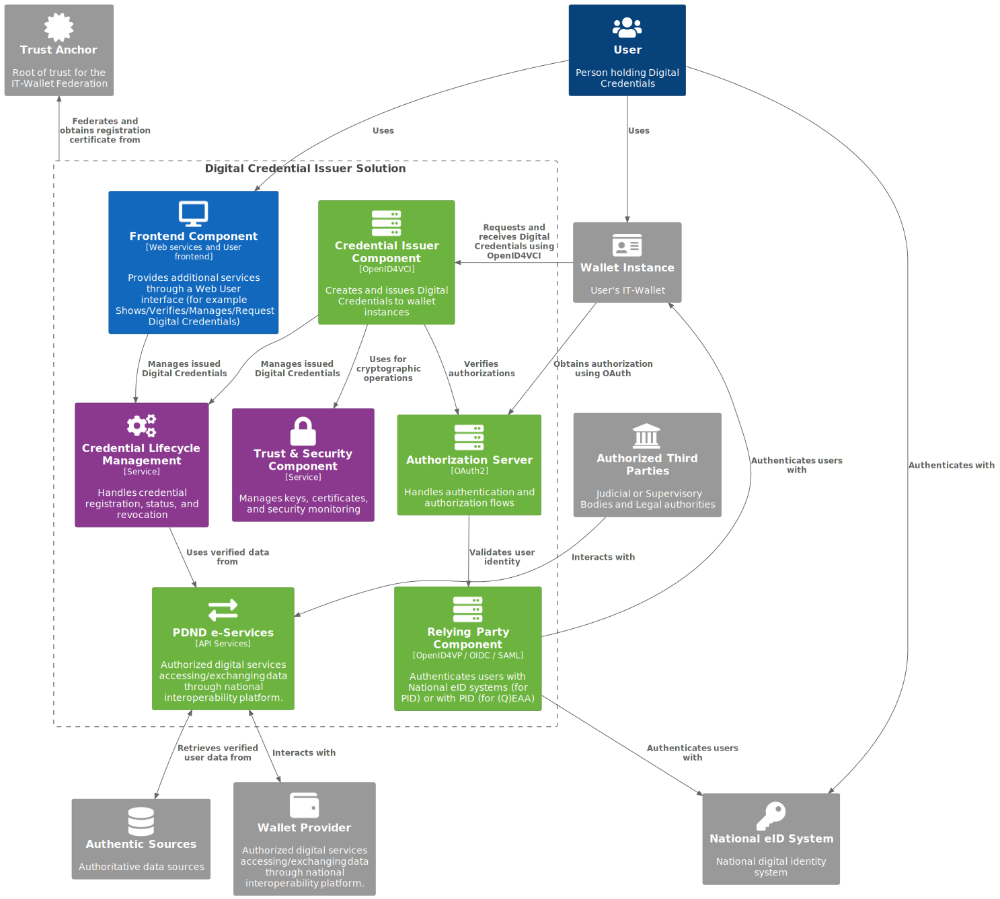

.. include:: ../common/common_definitions.rst

.. _issuer-solution:

Issuer Solution
+++++++++++++++

An Issuer, as an Organizational Entity participating in the IT-Wallet ecosystem, MUST provide technical Solutions (Issuer Solution) that combine software, hardware, services, settings, and configurations to issue Digital Credentials to User Wallet Instances in a secure and trusted manner.

Logical architecture is composed of the following elements:

   - **Trust Anchor**: It represents the root of trust for the entire IT-Wallet Federation and allows Issuers to federate in the ecosystem. The Trust Anchor has PKI capabilities and issues Registration Certificates during the Issuer onboarding process.
   - **Digital Credential Issuer Solution**: Organizational Entity that provides the services and components required for issuing Digital Credentials to Users through their Wallet Instances. This solution includes:
      
      - **Frontend Component**: Provides additional services through a Web User interface, allowing users to view, verify, manage, and request Digital Credentials.
      
      - **Credential Issuer Component**: Creates and issues Digital Credentials to Wallet Instances following the Issuance Flow as defined in Section :ref:`pid_eaa_issuance.rst`.
      
      - **Authorization Server**: Handles authentication and authorization flows as specified in OAuth 2.0, managing access tokens and authorization codes required during the credential issuance process.
      
      - **Relying Party Component**: Authenticates users either with National eID systems (for PID issuance) using OIDC, or SAML protocols, or with PID (for (Q)EAA issuance) using `OpenID4VP`_ protocol (see Section :ref:`Remote Flow` for technical details).
      
      - **Authentic Source Integration**: Provides API Services to retrieve verified user data from authentic sources.
      
      - **Credential Lifecycle Management**: Handles credential registration, status tracking, and revocation processes.
      
      - **Trust & Security Component**: Manages keys, certificates, and security monitoring to ensure the integrity of the issuance process.

The following diagram depicts the Issuer Solution High Level Architecture.

X_UboOiIkyOPBn36zm-ZnvjnxqtYlaV3k-zF3xST0kkgP8aygnFWj7iy8ujZLKegHVduTJKUl4_kkIXSAerDYy2Mg4IEnnVz6ANcCnupZTqS4gRPbAcErfc8dxjPclfLnvn5sj6IC1Sekza-uwfxfjqiUJA9cKow6UDBF6T5YXEMwOv7WUfPYtB3kM6bjCX1wLM6gZT8afiCSopq8qiF8tpHA0kMHU_Wbsaw59cGdwAtL_RFh1bilxeqasBjX4nG-jLKuYewseKbAkPChaBKavEFbzEa4-hR3zFpoylp9h12udlIWFuOJy_EPjsWpzdbsUaLGHz00rmkU8mgnCQhAMNU3PkTNfwSV6YchMMbT0XxEJYxklpQ3VRYulJiOa2mjOJeEGABjP0AM970-Xn1hPJ6NFNkKIfH71fMleFeYNuY-dMhC1TPmeiKhZcf33aD9IQKAcUPhTqfoQV83Xz57LlCoSsBFbooB4CzuONIh8YH8F-oAp3oAv6FTg1Wz7ZiDWscPgdw5D1j7SMFGnYdO9eBCfmWJmZnk_y475s3CuksbnDV2BTbw9LlGtjW6kqmAAlqtFZ74oKgQQiRh9TWR9TKv1S5OL3q1OAHFb1-jpNWMYJ3g9OR4-eTOHBue_c4WVqqmHw4q21cOCti9KOPrRs5hvYWj7re3xubwRj4QboBKr7P8UjzyVySScinKTw2ycfoPnScEe9_Uq1_GQoSyGBYzSseZ45zMQ_ZpAIzyypHV_N_raQHOHrEmO-h6m33ELYxMQfBiU29sKqIxcXIU-Yv55Kw1mO4v7mvUSePYn4EJPFnXULbXZ2UYwNg_q19lKFL_yOAbjBl0_vTeTBx9kYeFWSlWm47d3f7HxPmtnxVk2yiVlQLxkzEl8aoSOsYEflz3nfrLs8nkZx_CHn5pfXftp6BeFPL05g06tHmWnumsqjmM9QxKgcgC64pKHEtLy_DFvQjC7Ok9aUpSMh--uCIor31PXATgKcN1SwpJ2n_CYU9sOh4Rr8ogLTcmDmtt9ll_SsxXpxSZQw7z3CUVBkDjeN1zjCg9IovdaCWLLwD7QNkHzT78AGpem-tUlZdqSrWSFGpjJGLQs9Od3evsADUCAgtRH7t8nZNbnwrGakE2r-GKpQQgRm-ZrheMjFTVhM4IOSiplWCurMSOKZas_Kok7dB_NduNBUPKeE1n9GhlIvUQQOhzSvoH-92nA56kYiv44YHgjrSlJXJZHKPhJRo_2kC_PAtRIRebGBebg4ijjJNvxJ6X5mKN0j956n9phoOARd_TeHROcRBKdDUgXunsL_upMkQDCvKLvk4Dsp0PyTaRzs0sYT2NWwLxtQCVF6Aj5JAp5gjIgz52PNZRgePxUs8WCSogHECmGc7kxt8UcZ9Uvzpiudj_g7QxShC3vRnPEEtUQbursPJTphWRw2T5gZNtVTEMKrBQvRiEQ8Mo70OFAdiaoIMgrABLB9opcCG9SfcUerSMiNBWozSsKcjHHwotNbtDz2s3MOeSfv2pIT8A-6xS7nh4-vcCwFZxP5-viniyfEdvajjvttftul-4I3SO0NQkIrMcyuSmEzIL2KLfe0SU88xhnQoC0bShnEOqlAhxHkAmiObvFrk8VsxE8G35xX0Qv0M2hP7RJko3fxXD8K-dycYohF_0G00

   Issuer Solution High Level Architecture

Issuer Solution Requirements
============================

This section lists the requirements to be met by Digital Credential Issuer Solutions.

   - The Issuer Solution MUST register with the Federation Authority to obtain a Registration Certificate that explicitly authorizes which credential types and specific attributes may be issued.
   - The Issuer Solution MUST implement secure mechanisms for creating and issuing Digital Credentials, ensuring the integrity and confidentiality of the issuance process.
   - The Issuer Solution MUST communicate with Authentic Sources to obtain verified user data for credential issuance through secure, trusted and reliable API Services.
   - The Relying Party Component MUST be properly federated within the national eIDAS digital identity ecosystem when acting as a PID Provider.
   - For PID issuance, the Relying Party Component MUST authenticate users with LoA High using the national Digital Identity Providers.
   - For (Q)EAA issuance, if User authentication is required, the Relying Party Component MUST authenticate users by verifying a valid PID from the user's Wallet Instance using `OpenID4VP`_, as defined in Section :ref:`Remote Flow`.
   - The Credential Lifecycle Management Component MUST implement proper procedures for credential management, including issuance, status tracking, revocation, and renewal (see :ref:`Digital Credential Lifecycle` for more technical details).
   - The Trust & Security Component MUST maintain an audit trail of credential issuances while respecting privacy requirements and data protection regulations.
   - The Credential Issuer Component MUST support Selective Disclosure mechanisms in the credentials it issues.
   - The Issuer Solution MUST periodically renew its trust with the Federation to maintain its ability to issue credentials.
   - The Issuer Solution MUST authenticate to Wallet Instances during the issuance flow to prove the legitimacy and authorization of its issuance capabilities.
   - The Credential Issuer Component MUST support immediate issuance flow and MAY also support deferred issuance flow to accommodate various operational scenarios.
   - The Issuer Solution MUST implement appropriate error handling and user notifications for all credential issuance processes.
   - The Frontend Component MAY provide additional web services to allow Users to view, verify, manage, and request Digital Credentials through a Web User interface.
   - The Frontend Component MUST implement user authentication with a Level of Assurance (LoA) at least equal to that used to obtain the credential being issued.
   - The Frontend Component MUST provide appropriate security measures to protect user data and credential information displayed in the web interface.

.. _issuer-components:

Digital Credential Issuer Solution Components
=============================================

Frontend Component
------------------

The Frontend Component SHOULD provide a web-based user interface that allows for additional services related to Digital Credentials, such as:

   - Display issued credentials and their status.
   - Verify that the issued Digital Credentials are valid and authentic.
   - Manage credential lifecycle (i.e. revocation).
   - Initiate credential issuance through user interfaces by generating Credential Offers to be scanned by Wallet Instances.
   - Provide user support and documentation for credential usage.

The Frontend Component MUST implement user authentication with a Level of Assurance (LoA) at least equal to that used to obtain the credential itself. For instance, if a credential was issued after authentication with LoA High, any subsequent access to manage that credential through the Frontend Component must also require authentication with LoA High.

Credential Issuer Component
---------------------------

The Credential Issuer Component MUST be based on the OpenID for Verifiable Credential Issuance specification [`OpenID4VCI`_] following the implementation profile defined in Section :ref:`pid_eaa_issuance.rst`, and it MUST be responsible for:

   - Creating and issuing Digital Credentials to Wallet Instances.
   - Implementing the Credential Issuance protocols and flows (see Section :ref:`pid_eaa_issuance.rst` for technical details).
   - Processing Digital Credentials requests from Wallet Instances.
   - Requesting and obtaining User Data from the Authentic Source through secure, trusted and reliable API Services
   - Generating properly formatted and signed credentials.
   - Supporting different Digital Credentials formats, i.e. SD-JWT-VC, mDoc-CBOR, (see Section :ref:`pid_eaa_data_model.rst` for more details).

Authorization Server
--------------------

The OAuth2-based Authorization Server MUST handle:

   - Authentication and authorization flows for credential issuance
   - Managing access tokens and authorization codes
   - Validating user identity confirmed by the Relying Party Component

Relying Party Component
-----------------------

When the User authentication is required, the Credential Issuer MUST provide a Relying Party Component. This component MAY handle user authentication through multiple protocols (OpenID4VP, OIDC, SAML) and has dual functionality:

   - For PID issuance: It MUST authenticate users with the national Digital Identity Providers, based on OpenID Connect Core 1.0 or SAML2 protocols.
   - For (Q)EAA issuance: It MUST authenticate users by requesting presentation of a valid PID from their Wallet Instance. This component acts as a web Relying Party Instance by sending a presentation request to the Wallet Instance, according to [`OpenID4VP`_].

Authentic Source Integration
----------------------------

This component MUST: 

   - Establish secure connections with Authentic Sources.
   - Implement appropriate authentication and authorization for these connections.
   - Format and prepare the retrieved data according to credential schemas.
   - Retrieve verified user data from authoritative registries and databases.
   - Provide the Authentic Source with cryptographic evidence of User authentication, when required by the Authentic Source.

.. note::
   In case of public Authentic Sources, a Credential Issuer MUST use PDND according to the rules defined in Section :ref:`e-Service PDND <e-service-pdnd>` and in Section :ref:`Status Update by Authentic Sources <Status Update by Authentic Sources>`. See also Section :ref:`Authentic Source Catalogue <authentic_source_catalogue>` for additional details.

Credential Lifecycle Management
-------------------------------

This trust-related component MUST handle the entire lifecycle of issued Digital Credentials, including:

   - **Credential Status Management**: Maintaining and updating the validity status of Digital Credentials
   - **Revocation Processes**: Implementing mechanisms to revoke or suspend Digital Credentials when necessary, according to Section :ref:`Digital Credential Lifecycle`.
   - **Renewal Workflows**: Managing the renewal of Digital Credentials according to the mechanisms defined in Section :ref:`pid_eaa_issuance.rst`.

Trust & Security Component
--------------------------

This component MUST ensure the security and trust of the Issuer Solution by:

- Managing cryptographic keys and certificates.
- Implementing audit logging for security events.
- Monitoring for and responding to security incidents
- Ensuring compliance with security requirements of the IT-Wallet Federation

.. _issuer-endpoints:

Digital Credential Issuer Solution Endpoints
============================================

The Digital Credential Issuer Solution MUST expose a predefined set of endpoints supporting all the features required for trust evaluation and credential issuance. 

Federation Endpoints
--------------------

The Issuer Solution MUST provide a Federation Endpoint at the well-known location `/.well-known/openid-federation` that serves the Entity Configuration document as specified in Section :ref:`Entity Configuration of PID/(Q)EAA Providers`. This endpoint enables the establishment of trust relationships within the IT-Wallet Federation and allows Wallet Instances to discover and verify the Issuer.

.. include:: pid-eaa-entity-configuration.rst

Credential Issuer Component Endpoints
-------------------------------------

Credential Issuer Component Endpoints MUST implement the protocols described in the PID/(Q)EAA Issuance Sections (see in Section :ref:`Low-Level Issuance Flow` for technical details).

Frontend Component Endpoints
----------------------------

The Frontend Component MAY implement additional endpoints to support its user interface functionalities:

- User authentication and session management endpoints
- Credential management UI endpoints
- Credential request initiation endpoints
- Credential offer generation endpoints
- User profile and preference management endpoints

These endpoints are meant for direct user interaction through web interfaces and are separate from the `OpenID4VCI`_ protocol endpoints used by Wallet Instances.

Interaction Patterns
--------------------

The Digital Credential Issuer Solution supports several interaction patterns between its components and external entities:

1. **User to Frontend Component**: Direct web-based interactions where users can request credentials, view status, and manage their digital credential portfolio.

2. **Frontend Component to Credential Issuer Component**: Internal interactions that convert user requests into proper `OpenID4VCI`_ protocol messages, including the generation of Credential Offers.

3. **Wallet Instance to Credential Issuer Component**: Direct protocol-based interactions following the Issuance Flow as defined in Section :ref:`pid_eaa_issuance.rst`.

4. **Relying Party Component to National eID/Wallet Instance**: Authentication interactions that verify the user's identity either through national eID systems (for PID issuance) or by verifying the user's PID (for (Q)EAA issuance).

5. **Authentic Source Integration to Authentic Sources**: Backend API calls to retrieve verified user data from Authentic Sources.

The implementation of these flows and interaction patterns MUST adhere to the security considerations outlined in Section :ref:`pid_eaa_issuance.rst`, including proper handling of tokens, proofs, and cryptographic materials.

