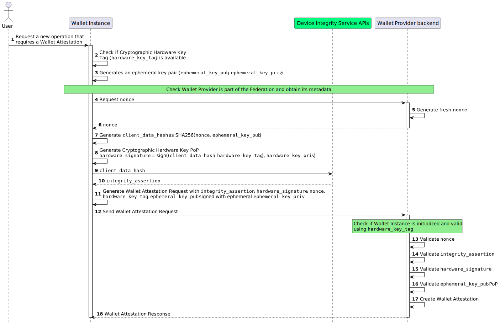

.. include:: ../common/common_definitions.rst

.. _wallet-attestation.rst:

Wallet Attestation Issuance
~~~~~~~~~~~~~~~~~~~~~~~~~~~~~~~~~~~~~~~~~
Wallet Attestation contains information regarding the security level of the device hosting the Wallet Instance.
It primarily certifies the **authenticity**, **integrity**, **security**, **privacy**, and **trustworthiness** of a particular Wallet Instance.

.. figure:: ../../images/static_view_wallet_instance_attestation.svg
   :name: Wallet Solution Schema
   :alt: The image illustrates the containment of Wallet Provider and Wallet Instances within the Wallet Solution, managed by the Wallet Provider.
   :target: https://www.plantuml.com/plantuml/uml/VP8nJyCm48Lt_ugdTexOCw22OCY0GAeGOsMSerWuliY-fEg_9mrEPTAqw-VtNLxEtaJHGRh6AMs40rRlaS8AEgAB533H3-qS2Tu2zxPEWSF8TcrYv-mJzTOGNfzVnXXJ0wKCDorxydAUjMNNYMMVpug9OTrR7i22LlaesXlADPiOraToZWyBsgCsF-JhtFhyGyZJgNlbXVR1oX5R2YSoUdQYEzrQO1seLcfUeGXs_ot5_VzqYM6lQlRXMz6hsTccIbGHhGu2_hhfP1tBwHuZqdOUH6WuEmrKIeqtNonvXhq4ThY3Dc9xBNJv_rSwQeyfawhcZsTPIpKLKuFYSa_JyOPytJNk5m00

This section describes how the Wallet Provider issues a Wallet Attestation.

zfDsFO4x-jrG442mj01NaqTXPq5Ab2VhzPOzQKkOJ5QyPo9QqA4casYOMnIA7en-Azhpah8PyBEMdVjbBQxmM9USmHNwV86Uu8QMOJ81LkuMkSAq8hD5S4asIecjBL1TqboF5Sne2JMoLzwlZpVQttZhXC2rvAE4gHg4ms_NbrSFbtSN5z_DYv1X9DerHWRkMOqIVA5yxHjj3YuLP0ii0UOacAEWqG2xJcObKlj4aQ92iZAosuAsuuX1wzS1UpVWB87mdE9W34eZUcL-zoAd7LOp5bCigPYi955jKc8eDLmCS7zrzkxzXwCDtnJg9gquItujPiVZJ7jUJ3bltUsJFdov-cyIkB0eZIUz-mZnT3HKCeL5bt-oAT9dJ0IBZG2KS0B5Ii5cwCz282_iNZCUcrZInyNhaWJNDIfdrDxhATxim8Ab_1_P5COzJtSVQ_faz-K73rYyrFIle48Z7-LT_txMDoFUpzizsNoFWTtfwnSZ7iSN8sxeu0SfxWPR5iQA_rBUBKIhV-Uc2MmBs6DEiEZWuqdrAzJlnSz8Z39OXH70-BECGyVRZoDZmjrCzzVga5ukNoSzMDDnn61VjyzQPaurXsPU_GC0

**Step 1**: The User initiates a new operation that necessitates the acquisition of a Wallet Attestation.

**Steps 2-3**: The Wallet Instance MUST:

  1. Verify the existence of Cryptographic Hardware Keys. If none exist, Wallet Instance re-initialization is required.
  2. Generate an ephemeral asymmetric key pair for Wallet Attestation, linking the public key to the attestation.
  3. Verify the Wallet Provider's federation membership and retrieve its metadata.

**Steps 4-6 (Nonce Retrieval)**: The Wallet Instance solicits a one-time "challenge" from the `nonce endpoint`_ of the Wallet Provider Backend. This "challenge" takes the form of a ``nonce``, which is required to be unpredictable and serves as the main defense against replay attacks. 
The ``nonce`` MUST be produced in a manner that ensures its single-use within a predetermined time frame.

Below is a non-normative example of a Nonce Request.

.. code-block:: http

    GET /nonce HTTP/1.1
    Host: walletprovider.example.com

Upon a successful request, the Wallet Provider generates and returns the nonce value to the Wallet Instance. 
Below is a non-normative example of a Nonce Response.

.. code-block:: http

    HTTP/1.1 200 OK
    Content-Type: application/json

    {
      "nonce": "d2JhY2NhbG91cmVqdWFuZGFt"
    }

**Step 7**: The Wallet Instance performs the following actions:

  * Creates ``client_data``, a JSON object that includes the challenge and the thumbprint of ephemeral public ``jwk``.
  * Computes ``client_data_hash`` by applying the ``SHA256`` algorithm to the ``client_data``.

Below is a non-normative example of the ``client_data`` JSON object.

.. code-block:: json

  {
    "challenge": "0fe3cbe0-646d-44b5-8808-917dd5391bd9",
    "jwk_thumbprint": "vbeXJksM45xphtANnCiG6mCyuU4jfGNzopGuKvogg9c"
  }

**Steps 8-10**: The Wallet Instance:

  *  produces an ``hardware_signature`` value by signing the ``client_data_hash`` with the Wallet Hardware's private key, serving as a proof of possession for the Cryptographic Hardware Keys.
  *  requests the Device Integrity Service to create an ``integrity_assertion`` value linked to the ``client_data_hash``.
  *  receives a signed ``integrity_assertion`` value from the Device Integrity Service, authenticated by the OEM.

.. note:: ``integrity_assertion`` is a custom payload generated by Device Integrity Service, signed by device OEM and encoded in base64 to have uniformity between different devices.

**Steps 11-12 (Wallet Attestation Issuance Request)**: The Wallet Instance:

  * Constructs the Wallet Attestation Request in the form of a JWT. This JWT includes the ``integrity_assertion``, ``hardware_signature``, ``challenge``, ``hardware_key_tag``, ``cnf`` and other configuration related parameters (see :ref:`Table of the Wallet Attestation Request Body <table_wallet_attestation_request_claim>`) and is signed using the private key of the initially generated ephemeral key pair.
  * Submits the Wallet Attestation Request to the `wallet-attestation-issuance endpoint`_ of the Wallet Provider Backend.

Below is a non-normative example of the Wallet Attestation Request JWT without encoding and signature applied:

.. code-block::

  {
    "alg": "ES256",
    "kid": "vbeXJksM45xphtANnCiG6mCyuU4jfGNzopGuKvogg9c",
    "typ": "war+jwt"
  }
  .
  {
    "iss": "https://wallet-provider.example.org/instance/vbeXJksM45xphtANnCiG6mCyuU4jfGNzopGuKvogg9c",
    "sub": "https://wallet-provider.example.org/",
    "challenge": "6ec69324-60a8-4e5b-a697-a766d85790ea",
    "hardware_signature": "KoZIhvcNAQcCoIAwgAIB...redacted",
    "integrity_assertion": "o2NmbXRvYXBwbGUtYXBwYX...redacted",
    "hardware_key_tag": "WQhyDymFKsP95iFqpzdEDWW4l7aVna2Fn4JCeWHYtbU=",
    "cnf": {
      "jwk": {
        "crv": "P-256",
        "kty": "EC",
        "x": "4HNptI-xr2pjyRJKGMnz4WmdnQD_uJSq4R95Nj98b44",
        "y": "LIZnSB39vFJhYgS3k7jXE4r3-CoGFQwZtPBIRqpNlrg"
      }
    },
    "vp_formats_supported": {
        "jwt_vc_json": {
          "alg_values_supported": ["ES256K", "ES384"]
        },
        "jwt_vp_json": {
          "alg_values_supported": ["ES256K", "EdDSA"]
        },
      },
    },
    authorization_endpoint": "https://wallet-solution.digital-strategy.europa.eu/authorization",
    "response_types_supported": [
      "vp_token"
    ],
    "response_modes_supported": [
      "form_post.jwt"
    ],
    "request_object_signing_alg_values_supported": [
      "ES256"
    ],
    "iat": 1686645115,
    "exp": 1686652315
  }

The Wallet Instance MUST send the signed Wallet Attestation Request JWT as an ``assertion`` parameter in the body of an HTTP request to the Wallet Provider's `wallet-attestation-issuance endpoint`_.

Below is a non-normative example of a Wallet Attestation Issuance Request.

.. code-block:: http

    POST /wallet-attestation HTTP/1.1
    Host: wallet-provider.example.org
    Content-Type: application/json

    {
      "assertion": "eyJhbGciOiJFUzI1NiIsImtpZCI6ImtoakZWTE9nRjNHeG..."
    }

**Steps 13-17**: The Wallet Provider Backend evaluates the Wallet Attestation Request and MUST perform the following checks:

    1. The request MUST include all required HTTP header parameters as defined in :ref:`Table of the Wallet Attestation Request Header <table_wallet_attestation_request_claim>`.
    2. The signature of the Wallet Attestation Request MUST be valid and verifiable using the provided ``jwk``.
    3. The ``challenge`` value MUST have been generated by the Wallet Provider and not previously used.
    4. A valid and currently registered Wallet Instance associated with the provided MUST exist.
    5. The ``client_data`` MUST be reconstructed using the ``challenge`` and the ``jwk`` public key.  The ``hardware_signature`` parameter value is then validated using the registered Cryptographic Hardware Key's public key associated with the Wallet Instance.
    6. The ``integrity_assertion`` MUST be validated according to the device manufacturer's guidelines.  The specific checks performed by the Wallet Provider are detailed in the operating system manufacturer's documentation.
    7. The device in use MUST be free of known security flaws and meet the minimum security requirements defined by the Wallet Provider.
    8. The URL in the ``iss`` parameter MUST match the Wallet Provider's URL identifier.

Upon successful completion of all checks, the Wallet Provider issues a Wallet Attestation valid for a maximum of 24 hours.

Below is a non-normative example of the Wallet Attestation without encoding and signature applied:

.. code-block::

    {
    "alg": "ES256",
    "kid": "5t5YYpBhN-EgIEEI5iUzr6r0MR02LnVQ0OmekmNKcjY",
    "trust_chain": [
      "eyJhbGciOiJFUz...6S0A",
      "eyJhbGciOiJFUz...jJLA",
      "eyJhbGciOiJFUz...H9gw",
    ],
    "typ": "wallet-attestation+jwt",
  }
  .
  {
    "iss": "https://wallet-provider.example.org",
    "sub": "vbeXJksM45xphtANnCiG6mCyuU4jfGNzopGuKvogg9c",
    "aal": "https://trust-list.eu/aal/high",
    "cnf":
    {
      "jwk":
      {
        "crv": "P-256",
        "kty": "EC",
        "x": "4HNptI-xr2pjyRJKGMnz4WmdnQD_uJSq4R95Nj98b44",
        "y": "LIZnSB39vFJhYgS3k7jXE4r3-CoGFQwZtPBIRqpNlrg"
      }
    },
    "authorization_endpoint": "https://wallet-solution.digital-strategy.europa.eu/authorization",
    "response_types_supported": [
      "vp_token"
    ],
    "response_modes_supported": [
      "form_post.jwt"
    ],
    "vp_formats_supported": {
        "dc+sd-jwt": {
            "sd-jwt_alg_values": [
                "ES256",
                "ES384"
            ]
        }
    },
    "request_object_signing_alg_values_supported": [
      "ES256"
    ],
    "iat": 1687281195,
    "exp": 1687288395
  }

**Step 18 (Wallet Attestation Issuance Response)**: Upon successful completion, the Wallet Provider MUST return a confirmation response, containing the Wallet Attestation signed by the Wallet Provider. The Wallet Instance will then perform security, integrity, and trust verification of the Wallet Attestation and its issuer.

Below is a non-normative example of a Wallet Attestation Issuance Response.

.. code-block:: http

    HTTP/1.1 200 OK
    Content-Type: application/jwt

    eyJhbGciOiJFUzI1NiIsInR5cCI6IndhbGx ...

.. _Wallet Attestation Request: wallet-attestation-issuance.html#format-of-the-wallet-attestation-request
.. _RFC 7523 section 4: https://www.rfc-editor.org/rfc/rfc7523.html#section-4
.. _RFC 8414 section 2: https://www.rfc-editor.org/rfc/rfc8414.html#section-2
.. _Play Integrity API: https://developer.android.com/google/play/integrity?hl=it
.. _DeviceCheck: https://developer.apple.com/documentation/devicecheck
.. _OAuth 2.0 Nonce Endpoint: https://datatracker.ietf.org/doc/draft-demarco-oauth-nonce-endpoint/
.. _ARF: https://github.com/eu-digital-identity-wallet/eudi-doc-architecture-and-reference-framework
.. _Play Integrity API Errors: https://developer.android.com/google/play/integrity/error-codes
.. _TEE Client API Errors: https://globalplatform.org/wp-content/uploads/2010/07/TEE_Client_API_Specification-V1.0.pdf

