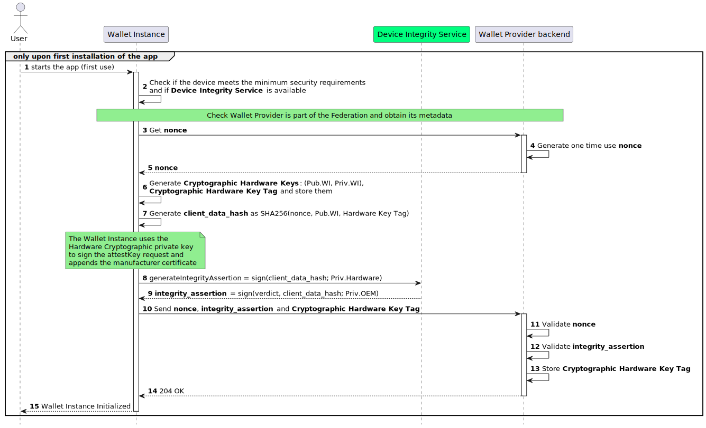

.. include:: ../common/common_definitions.rst

.. _wallet-solution.rst:

Wallet Solution
^^^^^^^^^^^^^^^^^^^^^^^^^^^^^^^^^^^

The Wallet Solution is issued by the Wallet Provider in the form of a mobile app and services, such as web interfaces.

The mobile app serves as the primary interface for Users,
allowing them to hold their Digital Credentials and interact with other participants of the ecosystem,
such as Credential Issuers and Relying Parties.

These Credentials are a set of data that can uniquely identify a natural or legal person,
along with other Qualified and non-qualified Electronic Attestations of Attributes,
also known as QEAAs and EAAs respectively, or (Q)EAAs for short[1]. 

Once a User installs the mobile app on their device, such an installation is referred to as a Wallet Instance for the User.

By supporting the mobile app, the Wallet Provider enusers the security and reliability of the entire Wallet Solution,
as it is responsible for issuing the Wallet Attestation,
which is a cryptographic proof about the authenticity and integrity of the Wallet Instance.

Wallet Solution Requirements
-----------------------------

This section lists the requirements that are be met by Wallet Providers and Wallet Solutions.

 - The Wallet Provider MUST offer a RESTful set of services for issuing the Wallet Attestations.
 - The Wallet Instance MUST periodically reestablish trust with its Wallet Provider.
 - The Wallet Instance MUST establish trust with other participants of the Wallet ecosystem, such as Credential Issers and Relying Parties.
 - The Wallet Solutions MUST adhere to the specifications set by this document for obtaining Personal Identification (PID) and (Q)EAAs.
 - The Wallet Instance MUST be compatible and functional on both Android and iOS operating systems and available on the Play Store and App Store, respectively.
 - The Wallet Instance MUST provide a mechanism to verify the User's actual possession and full control of their personal device.

Wallet Instance
------------------------------

The Wallet Instance serves as a unique and secure device for authenticating the User within the Wallet ecosystem.
It establishes a strong and reliable mechanism for the User to engage in various digital transactions in a secure and privacy-preserving manner.

The Wallet Instance allows other entities within the ecosystem to establish trust with it, by consistently
presenting a Wallet Attestation during interactions with PID Providers,
(Q)EAA Providers, and Relying Parties. These verifiable attestations, provided by the Wallet Provider,
serve to authenticate the Wallet Instance itself, ensuring its reliability when engaging with other ecosystem actors.

To guarantee the utmost security, these cryptographic keys MUST be securely stored within the WSCD, which MAY be internal (device's Trusted Execution Environment (TEE)[3]), external, or hybrid. This ensures that only the User can access them, thus preventing unauthorized usage or tampering. For more detailed information, please refer to the `Wallet Attestation section`_ and the `Trust Model section`_ of this document.

Wallet Instance Lifecycle
~~~~~~~~~~~~~~~~~~~~~~~~~~~~~~~

The Wallet Provider is in charge of the implementation and provision of Wallet Instances also handling their entire lifecycle. 

In this section, state machines are presented to explain the Wallet Instance and Digital Credential states and their transitions and relations.

.. note::

  PID is specialized Digital Credential type that produces impacts on the Wallet Instance's lifecycle. The revocation of the PID MAY also have potential impacts on (Q)EAAs, if these was issued using the presentation of the PID. 
  When the distinction between PID and (Q)EAA is not needed, the term Digital Credential is used.

.. note::

  In the current version of `EIDAS-ARF`_, two types of attestations have been introduced: Wallet Trust Evidence (WTE) and Wallet Instance Attestation (WIA). The first to prove that the keys used for key 
  binding of Digital Credentials reside in a trustworthy WSCD, the second to prove that the Wallet Instance is authentic. In this technical specification, a single attestation (Wallet Attestation) is 
  used as proof of both the Wallet Instance authenticity and WSCD trustworthiness. The future version of this specification will be updated accordingly. 

As shown in :numref:`fig_Wallet_Instance_States`, the Wallet Instance has four distinct states: **Installed**, **Operational**, **Valid**, and **Uninstalled**. 
Each state represents a specific functional status and determines the actions that can be performed.

.. _fig_Wallet_Instance_States:
.. figure:: ../../images/Wallet_Instance_States.svg
    :figwidth: 100%
    :align: center
    :target: https://www.plantuml.com/plantuml/svg/XPBHIuH04CRVzwyOk9SAH8ipGaHESW-4kEpihg1wi7ElMzXRHLUY_lfMAvtMZlD5cUytttpZxgnMMQMQlI0xdZDW-r9zGCxgJSLBnGj9Y0OKWrZgjn0iXyby7hgEyrE_BLcLjM0cOBBLJw-iCy4rxJXNJbzRIJxuH9TJT-eI0W1FPozWvSMxj89XaWSFCSIBzBubXd8FjcOONIt-Wol-jbEQHa4xEhpkK5m_xcpWWctLAF6IhaUaET_V5AAel5VHiE3axfI68SHfQYTBwjkT51pCrltMlmv97BNjkFKR0wifZT5c7trCxDz6U9POrelO4RqvP3jU6n4egB4gnQlYiJWLKf7fyUF14bWQrHTBHwZv9_FEBmBVRhy2CcCorrV-2m00

    Wallet Instance Lifecycle.

.. note::

  The Wallet Provider MUST ensure the security and reliability of the Wallet Instances. To achieve this, the Wallet Provider MUST periodically checks the Wallet Instances security and compliance status. 

.. note::

  The Wallet Attestation is short-lived. It MUST be automatically re-issued before its expiration time. For this reason, the Wallet Instance expiration 
  transition is not considered in :numref:`fig_Wallet_Instance_States`.

Transition to Installed
....................................
The state machine begins with the Wallet Instance installation (**WI INST**) transition, where Users download and install a Wallet Instance provided by the Wallet Provider using the 
official app store of their device's operating system (this ensures authenticity via system checks), leading to the **Installed** state.

When the state is **Installed**, the Wallet Instance MUST interact only with the Wallet Provider to be activated. When the revocation of the Wallet Instance occurs, the Wallet Instance MUST go back from **Operational** or **Valid** to **Installed**. The revocation marks the Wallet Cryptographic Hardware Key, registered during activation 
(see “Transition to Operational” section), as not usable anymore. Revocation can occur in the following cases:

  * for technical security reasons (e.g., relating to the compromise of cryptographic material); 
  * in case of explicit User requests (e.g., due to loss, theft of the Wallet Instance);
  * death of the User;
  * illegal activities reported by Judicial or Supervisory Bodies.

.. note::

  While for the ARF the revocation of the Wallet Instance is accomplished by revoking the Wallet Attestation (see Topic 9 and Topic 38 in Annex 2), 
  in this specification the revocation is managed differently. Being the Wallet Attestation short-lived, it does not have a status management mechanism. 
  For this reason, the Wallet Instance revocation transition is accomplished by deleting the Wallet Cryptographic Hardware Key from the WSCD of the Wallet 
  Instance and from the account associated with the User. This transition is completed when the Wallet Instance is online.

Transition to Operational
....................................
After installation, the User opens the Wallet Instance and an activation begins (**WI ACT**). 
At this stage, a User account MUST be created with the Wallet Provider and associated with the Wallet Instance through the Wallet Cryptographic 
Hardware Key Tag, subject to obtaining the User's consent (see the “Wallet Instance Initialization and Registration” section for more details). 
This association allows the User to directly request Wallet Instance revocation from the Wallet Provider, and it also allows the Wallet Provider to 
revoke the Wallet Instance associated with that User.

.. note::

  As a result of the User account creation, an authentication mechanism MUST be set for the User to interact with the Wallet Provider portal. 
  This specification mandates the use of at least a second-factor for User authentication.  

As part of the activation, the Wallet Provider MUST evaluate the operating system and general technical capabilities of the device to check compliance 
with the technical and security requirements, and the authenticity and integrity of the installed Wallet Instance. 
Upon successful verification, the Wallet Provider MUST issue at least one valid Wallet Attestation to the Wallet Instance, therefore the Wallet Instance enters the **Operational** state. 

In addition, if not already done, Users MUST set their preferred method of unlocking their Wallet Instance; this MAY be accomplished by entering a 
personal identification number (PIN) or by utilizing biometric authentication, such as fingerprint or facial recognition, according to personal 
preferences and device's capabilities. Please refer to `Wallet Attestation`_.

In the **Operational** state, Users can request the issuance of PID (**PID ISS**) or (Q)EAAs if the PID is not required in the issuance 
(**(Q)EEA ISS**). In addition, if the Digital Credentials are (Q)EEAs and for the presentation they do not require the PID, they can be presented 
without transitioning the Wallet Instance to another state (**(Q)EEA PRE** transition). 

A **Valid** Wallet Instance MUST transition back to the **Operational** state due to **PID EXP/REV/DEL** transition, when the associated PID expires, or is revoked by its Provider or either deleted by the User. 

Transition to Valid
....................................
A transition to the Valid state occurs only when the Wallet Instance obtains a valid PID (**PID ISS**). In this state, Users can obtain and present 
new (Q)EAAs (**(Q)EAA ISS/PRE**), and present the PID (**PID PRE**). Please refer to :ref:`PID/(Q)EAA Issuance` and :ref:`Relying Party Solution`.

.. note::

  Users can have only one Wallet Instance in **Valid** state for the same Wallet Solution. Thus, when a User installs and obtains a PID on a new Wallet 
  Instance of the same Wallet Solution from the same Wallet Provider, the PID in the previous Wallet Instance MUST be revoked and the Wallet Instance became 
  **Operational**.

Transition to Uninstalled
....................................

Across all states, **Installed**, **Actived**, **Operational**, or **Valid**, the Wallet Instance can be removed entirely through the Wallet Instance 
uninstall (**WI UNINST**) transition, leading to the **Uninstalled** state. If a Wallet Instance is **Uninstalled** it ends its lifecycle.

Wallet Instance Lifecycle Management
~~~~~~~~~~~~~~~~~~~~~~~~~~~~~~~~~~~~~~~~~

While :numref:`fig_Wallet_Instance_States` shows the different states a Wallet Instance may acquire during its lifecycle, 
:numref:`fig_Wallet_Instance_Lifecycle` shows the point of view of Wallet Instances and Wallet Providers in managing the Wallet Instance lifecycle 
and the effect on their local storage.

.. _fig_Wallet_Instance_Lifecycle:
.. figure:: ../../images/wallet_instance_lifecycle.svg
    :figwidth: 100%
    :align: center
    :target: https://www.plantuml.com/plantuml/png/dP9Vgvim6CRl_HIPd0k5ddgpgq7XE0sSGhUAUbO6WnBDYnLYuf9NkpBstPUurPLEs9yRBzuyloV-aZmPP1g7JdYlMbcBWGCv8VRcJHHfTbutBPw6QZ2WQoKH9AvhrKMzOD8nZmQvQAieUVsOkT7BkrtKCOEWxUYOM8Ar4lIwT_tFsvGUYvBcT5z-p6WGUbxnl3ySCveN-_V7R9-NURmjtJpcF0THiYRmUUMlo0F25qoKK7hZAyra0sueRFVYiC2B0B8XAJCdu3ix2KBR-bODaZDz2OPgHVm34mAGRAL19ciWrrK_95yzuX5INAn85x3wyq8whh4T6RPAaayoE6n9d9IXRuD--0lb81RG74PLtw8v_N15BJkVMbe5PuDAh_p2Vba3SxttpRkngMziCgt6beE-ixd-K0FoVrqqZF_cSgSocP3VLEP8q0zkFMN8I3ReffND55ezc5wt21jVgqgXXPny3k87yBCsfJjQqWbmhuKrPkDUJkY2pdeE9ZcD5uDJShhhyv-YBZbTxVblTjSmphk_PEbovHD8FdJYEm00
    
    Wallet Instance Lifecycle Management.

Through a Wallet Instance in an **Installed** state, a User is able to start the **Wallet Instance Activation** (**WI ACT**). 
As a result, the Wallet Instance MUST create a Wallet Cryptographic Hardware Key pair. In addition, if not already done, 
Users MUST set their preferred method of unlocking their Wallet Instance. As a result of the **Wallet Instance Revocation** (**WI REV**), the Wallet Instance MUST 
delete the Wallet Cryptographic Hardware Key pairs.

A Wallet Provider instead is responsible for:

  * **Wallet Instance Activation** (**WI ACT**): a User account MUST be created and associated with the Wallet Instance through the Wallet Cryptographic Hardware Key Tag. As a result of the User account creation, an authentication mechanism of at least two factors MUST be set for the User to interact with the Wallet Provider portal. 
  * **Wallet Instance Revocation** (**WI REV**): for technical security reasons or triggered by external entities (e.g., Users and Supervisory Bodies) the Wallet Cryptographic Hardware Key Tag MUST be deleted from the User account.
  * **Data Purging**: through an explicit request of Users, the User account at the Wallet Provider MUST be removed from the local storage.

Wallet Provider Endpoints
------------------------------------

The Wallet Provider that issues the Wallet Attestations MUST make its APIs available in the form of RESTful services, as listed below.

Wallet Provider Entity Configuration
~~~~~~~~~~~~~~~~~~~~~~~~~~~~~~~~~~~~~~

An HTTP GET request to the **/.well-known/openid-federation** endpoint allows the retrieval of the Wallet Provider Entity Configuration.

The returning Entity Configuration of the Wallet Provider MUST contain the attributes described in the sections below.

The Wallet Provider Entity Configuration is a signed JWT containing the
public keys and supported algorithms of the Wallet Provider metadata definition.
It is structured in accordance with the `OpenID Connect Federation <https://openid.net/specs/openid-connect-federation-1_0.html>`_
and the Trust Model section outlined in this specification.

Wallet Provider Entity Configuration JWT Header
...................................................

.. list-table::
    :widths: 20 80
    :header-rows: 1

    * - **Key**
      - **Value**
    * - alg
      - Algorithm used to verify the token signature. It MUST be one of the possible values indicated in this `table <https://italia.github.io/eudi-wallet-it-docs/versione-corrente/en/algorithms.html>`_ (e.g., ES256).
    * - kid
      - Thumbprint of the public key used for signing, according to :rfc:`7638`.
    * - typ
      - Media type, set to ``entity-statement+jwt``.

Wallet Provider Entity Configuration JWT Payload
.....................................................

.. list-table::
    :widths: 20 80
    :header-rows: 1

    * - **Key**
      - **Value**
    * - iss
      - Public URL of the Wallet Provider.
    * - sub
      - Public URL of the Wallet Provider.
    * - iat
      - Issuance datetime in Unix Timestamp format.
    * - exp
      - Expiration datetime in Unix Timestamp format.
    * - authority_hints
      - Array of URLs (String) containing the list of URLs of the immediate superior Entities, such as the Trust Anchor or an Intermediate, that MAY issue an Entity Statement related to this subject.
    * - jwks
      - A JSON Web Key Set (JWKS) `RFC 7517 <http://tools.ietf.org/html/rfc7517.html>`_ that represents the public part of the signing keys of the Entity at issue. Each JWK in the JWK set MUST have a key ID (claim kid).
    * - metadata
      - Contains the ``wallet_provider`` and ``federation_entity`` metadata.

wallet_provider metadata
..................................

+---------------------------------------------+---------------------------------------------------------------------+
| **Key**                                     | **Value**                                                           |
+---------------------------------------------+---------------------------------------------------------------------+
| jwks                                        | A JSON Web Key Set (JWKS)                                           |
|                                             | that represents the  Wallet                                         |
|                                             | Provider's public keys.                                             |
+---------------------------------------------+---------------------------------------------------------------------+
| token_endpoint                              | Endpoint for obtaining the Wallet                                   |
|                                             | Instance Attestation.                                               |
+---------------------------------------------+---------------------------------------------------------------------+
| nonce_endpoint                              | HTTPs URL indicating the endpoint                                   |
|                                             | where the client can request the nonce.                             |
+---------------------------------------------+---------------------------------------------------------------------+
| aal_values_supported                        | List of supported values for the                                    |
|                                             | certifiable security context. These                                 |
|                                             | values specify the security level                                   |
|                                             | of the app, according to the levels: low, medium, or high.          |
|                                             | Authenticator Assurance Level values supported.                     |
+---------------------------------------------+---------------------------------------------------------------------+
| grant_types_supported                       | The types of grants supported by                                    |
|                                             | the token endpoint. It MUST be set to                               |
|                                             | ``urn:ietf:params:oauth:client-assertion-type:                      |
|                                             | jwt-client-attestation``.                                           |
+---------------------------------------------+---------------------------------------------------------------------+
| token_endpoint_auth_methods_suppor          | Supported authentication methods for                                |
| ted                                         | the token endpoint.                                                 |
+---------------------------------------------+---------------------------------------------------------------------+
| token_endpoint_auth_signing_alg_va          | Supported signature                                                 |
| lues_supported                              | algorithms for the token endpoint.                                  |
+---------------------------------------------+---------------------------------------------------------------------+

.. note::
   The `aal_values_supported` parameter is experimental and under review.

federation_entity metadata
...................................

+-------------------+----------------------------------------------+
| **Key**           | **Value**                                    |
+-------------------+----------------------------------------------+
| organization_name | Organization name.                           |
+-------------------+----------------------------------------------+
| homepage_uri      | Organization's website URL.                  |
+-------------------+----------------------------------------------+
| tos_uri           | URL to the terms of service.                 |
+-------------------+----------------------------------------------+
| policy_uri        | URL to the privacy policy.                   |
+-------------------+----------------------------------------------+
| logo_uri          | URL of the organization's logo in SVG format.|
+-------------------+----------------------------------------------+

Below a non-normative example of the Entity Configuration.

.. code-block:: javascript

  {
    "alg": "ES256",
    "kid": "5t5YYpBhN-EgIEEI5iUzr6r0MR02LnVQ0OmekmNKcjY",
    "typ": "entity-statement+jwt"
  }
  .
  {
  "iss": "https://wallet-provider.example.org",
  "sub": "https://wallet-provider.example.org",
  "jwks": {
    "keys": [
      {
        "crv": "P-256",
        "kty": "EC",
        "x": "qrJrj3Af_B57sbOIRrcBM7br7wOc8ynj7lHFPTeffUk",
        "y": "1H0cWDyGgvU8w-kPKU_xycOCUNT2o0bwslIQtnPU6iM",
        "kid": "5t5YYpBhN-EgIEEI5iUzr6r0MR02LnVQ0OmekmNKcjY"
      }
    ]
  },
  "metadata": {
    "wallet_provider": {
      "jwks": {
        "keys": [
          {
            "crv": "P-256",
            "kty": "EC",
            "x": "qrJrj3Af_B57sbOIRrcBM7br7wOc8ynj7lHFPTeffUk",
            "y": "1H0cWDyGgvU8w-kPKU_xycOCUNT2o0bwslIQtnPU6iM",
            "kid": "5t5YYpBhN-EgIEEI5iUzr6r0MR02LnVQ0OmekmNKcjY"
          }
        ]
      },
      "token_endpoint": "https://wallet-provider.example.org/token",
      "nonce_endpoint": "https://wallet-provider.example.org/nonce",
      "aal_values_supported": [
        "https://wallet-provider.example.org/LoA/basic",
        "https://wallet-provider.example.org/LoA/medium",
        "https://wallet-provider.example.org/LoA/high"
      ],
      "grant_types_supported": [
        "urn:ietf:params:oauth:client-assertion-type:jwt-client-attestation"
      ],
      "token_endpoint_auth_methods_supported": [
        "private_key_jwt"
      ],
      "token_endpoint_auth_signing_alg_values_supported": [
        "ES256",
        "ES384",
        "ES512"
      ]
    },
    "federation_entity": {
      "organization_name": "IT-Wallet Provider",
      "homepage_uri": "https://wallet-provider.example.org",
      "policy_uri": "https://wallet-provider.example.org/privacy_policy",
      "tos_uri": "https://wallet-provider.example.org/info_policy",
      "logo_uri": "https://wallet-provider.example.org/logo.svg"
    }
  },
  "authority_hints": [
    "https://registry.eudi-wallet.example.it"
  ]
  "iat": 1687171759,
  "exp": 1709290159
  }

Wallet Instance Initialization and Registration
-------------------------------------------------------

aBhWOSKI5TWS6HELRHHMe6lAnboEyFALdMRGbn6VRk1Y81hWCWVdBUf0iU-HSRscSWCyg5L3g9ReKQHbpsrg8LAP-fH2tnCBjUGrVlFegqoTJFxMncG2706to0qM3JadFYX1s99a7rDB2-VlRXSt3ujFy_a7DxWvxiSaSdzFcT-I3OSMie5GAB87rcZ65IjKTDPclycv8QhjcS62rAoMwwpkQ_EsxwHltRuzq9FaSV04oYtb1e-e6JrKU7HHqKXrt_HUrV3Nikiqr8BTcakuGQb-e13SqIvQOnsozCcY1daU3WzOsyvX2MgS0QfILBkws9kQmlC2bovJ_wJ9uzUzJ5-oEOfSUwgWsC7z_Fr1eqlhUHn_Uf9lOVuhnkdd-88DLpOURpeDEDezWYt_MMSSF-pztOdNjCiKIMPmz3zX1rOs9x-eEgGPnLbDxif-Kjly1W00

**Step 1**: The User starts the Wallet Instance mobile app for the first time.

**Step 2**: The Wallet Instance:

  * Checks whether the device meets the minimum security requirements.
  * Checks if the Device Integrity Service is available.

.. note::

    **Federation Check**: The Wallet Instance needs to check if the Wallet Provider is part of the Federation, obtaining its protocol-specific Metadata. A non-normative example of a response from the endpoint **.well-known/openid-federation** with the **Entity Configuration** and the **Metadata** of the Wallet Provider is represented within the section `Wallet Provider metadata`_.

**Steps 3-5**: The Wallet Instance sends a request to the `nonce endpoint`_ of the Wallet Provider Backend and receives a one-time ``challenge``. This "challenge" is a ``nonce``, which MUST be unpredictable to serve as the main defense against replay attacks. The backend MUST generate the ``nonce`` value in a manner that ensures it is single-use and valid only within a specific time frame. This endpoint is compliant with the specification `OAuth 2.0 Nonce Endpoint`_.

.. code-block:: http

    GET /nonce HTTP/1.1
    Host: walletprovider.example.com

.. code-block:: http

    HTTP/1.1 200 OK
    Content-Type: application/json

    {
      "nonce": "d2JhY2NhbG91cmVqdWFuZGFt"
    }

.. _Nonce Error Handling:

If any errors occur during the nonce generation, the Wallet Provider MUST return an error response as defined in :rfc:`6749#section-5.2`. The response MUST use *application/json* as the content type and MUST include the following parameters:

  - *error*. The error code.
  - *error_description*. Text in human-readable form providing further details to clarify the nature of the error encountered.

The following table lists HTTP Status Codes and related error codes that MUST be supported for the error response:

.. list-table::
   :widths: 30 20 50
   :header-rows: 1

   * - **HTTP Status Code**
     - **Error Code**
     - **Description**
   * - ``500 Internal Server Error`` 
     - ``server_error``
     - An internal server error occurred while processing the request.
   * - ``503 Service Unavailable`` 
     - ``temporarily_unavailable``
     - Service unavailable. Please try again later.

**Step 6**: The Wallet Instance, through the operating system, creates a pair of Cryptographic Hardware Keys and stores the corresponding Cryptographic Hardware Key Tag in local storage once the following requirements are met:

   1. It MUST ensure that Cryptographic Hardware Keys do not already exist. If they do exist and the Wallet is in the initialization phase, they MUST be deleted.
   2. It MUST generate a pair of asymmetric Elliptic Curve keys (Cryptographic Hardware Keys) via a local WSCD.
   3. It SHOULD obtain a unique identifier (Cryptographic Hardware Key Tag) for the generated Cryptographic Hardware Keys from the operating system. If the operating system permits specifying a tag during the creation of keys, then a random string for the Cryptographic Hardware Key Tag MUST be selected. This random value MUST be collision-resistant and unpredictable to ensure security. To achieve this, consider using a cryptographic hash function or a secure random number generator provided by the operating system or a reputable cryptographic library.
   4. If the previous points are satisfied, it MUST store the Cryptographic Hardware Key Tag in local storage.

.. note::

    **WSCD**: The Wallet Instance MAY use a local WSCD for cryptographic operations, including key generation, secure storage, and cryptographic processing,  on devices that support this feature. On Android devices, Strongbox is RECOMMENDED; Trusted Execution Environment (TEE) MAY be used only when Strongbox is unavailable. For iOS devices, Secure Elements (SE) MUST be used. Given that each OEM offers a distinct SDK for accessing the local WSCD, the discussion hereafter will address this topic in a general context.

    If the WSCD fails during any of these operations, for example due to hardware limitations, it will raise an error response to the Wallet Instance (e.g., see `TEE Client API Errors <TEE Client API Errors_>`_). The Wallet Instance MUST handle these errors accordingly to ensure secure operation. Details on error handling are left to the Wallet Instance implementation.

**Step 7**: The Wallet Instance uses the Device Integrity Service, providing the "challenge" and the Cryptographic Hardware Key Tag to acquire the Key Attestation.

.. note::

    **Device Integrity Service**: In this section, the Device Integrity Service is considered as it is provided by device manufacturers. This service allows the verification of a key being securely stored within the device's hardware through a signed object. Additionally, it offers verifiable proof that a specific Wallet Instance is authentic, unaltered, and in its original state using a specialized signed document made for this purpose.

    The service also incorporates details in the signed object, such as the device type, model, app version, operating system version, bootloader status, and other relevant information to assess whether the device has been compromised. For Android, the DIS is represented by *Key Attestation*, a feature supported by *StrongBox Keymaster*, which is a physical HSM installed directly on the motherboard, and the *TEE* (Trusted Execution Environment), a secure area of the main processor. *Key Attestation* aims to provide a way to strongly determine if a key pair is hardware-backed, what the properties of the key are, and what constraints are applied to its usage. Developers can leverage its functionality through the *Play Integrity API*. For Apple devices, the DIS is represented by *DeviceCheck*, which provides a framework and server interface to manage device-specific data securely. *DeviceCheck* is used in combination with the *Secure Enclave*, a dedicated HSM integrated into Apple's SoCs. *DeviceCheck* can be used to attest to the integrity of the device, apps, and/or encryption keys generated on the device, ensuring they were created in a secure environment like *Secure Enclave*. Developers can leverage *DeviceCheck* functionality by using the framework itself.
    These services, specifically developed by the manufacturer, are integrated within the Android or iOS SDKs, eliminating the need for a predefined endpoint to access them. Additionally, as they are specifically developed for mobile architecture, they do not need to be registered as Federation Entities through national registration systems.
    *Secure Enclave* has been available on Apple devices since the iPhone 5s (2013).
    For Android devices, the inclusion of **Strongbox Keymaster** may vary by manufacturer, who decides whether to include it or not.

    If any errors occur in any DIS process, such as device integrity verification, for example, due to an unavailable DIS, an internal error, or an invalid nonce in the integrity request, the DIS raises an error response (e.g., see  `Play Integrity API Errors <Play Integrity API Errors_>`_). The Wallet Instance MUST process these errors accordingly. Details on error handling are left to the Wallet Instance implementation.
 

**Step 8**: The Device Integrity Service performs the following actions:

* Creates a Key Attestation that is linked with the provided "challenge" and the public key of the Wallet Hardware.
* Incorporates information pertaining to the device's security.
* Uses an OEM private key to sign the Key Attestation, therefore verifieable with the related OEM certificate, confirming that the Cryptographic Hardware Keys are securely managed by the operating system.

**Step 9**: The Wallet Instance sends the ``challenge`` with Key Attestation and Cryptographic Hardware Key Tag to the `wallet-instance endpoint`_ of the Wallet Provider Backend to register the Wallet Instance identified by the Cryptographic Hardware Key public key.

In order to register the Wallet Instance, the request to the Wallet Provider MUST use the HTTP POST method. The parameters MUST be encoded using the `application/json` format and included in the message body. The following parameters MUST be provided:

.. _table_http_request_claim:
.. list-table:: Wallet Instance registration http request parameters
    :widths: 20 60 20
    :header-rows: 1

    * - **Claim**
      - **Description**
      - **Reference**
    * - **challenge**
      - MUST be set to the challenge obtained from the Wallet Provider throught the ``nonce`` endpoint.
      - `OAuth 2.0 Nonce Endpoint`_
    * - **key_attestation**
      - It MUST be a ``base64url`` encoded Key Attestation obtained from the **Device Integrity Service**.
      -
    * - **hardware_key_tag**
      - It MUST be set with the unique identifier of the **Cryptographic Hardware Keys** and encoded in ``base64url``.
      -

Below is a non-normative example of the request.

.. code-block:: http

    POST /wallet-instance HTTP/1.1
    Host: walletprovider.example.com
    Content-Type: application/json

    {
      "challenge": "0fe3cbe0-646d-44b5-8808-917dd5391bd9",
      "key_attestation": "o2NmbXRvYXBwbGUtYXBw... redacted",
      "hardware_key_tag": "WQhyDymFKsP95iFqpzdEDWW4l7aVna2Fn4JCeWHYtbU="
    }

.. note::
  It is not necessary to send the Wallet Hardware public key because it is already included in the ``key_attestation``.
  As seen in the previous steps, the Device Integrity Service (DIS) creates a Key Attestation linked to the provided "challenge" and the public key of the Wallet Hardware. This process eliminates the need to send the Wallet Hardware public key directly, as it is already included in the key attestation. The ``hardware_key_tag`` serves as a reference or identifier for the corresponding Cryptographic Hardware key stored by the Wallet Provider. Therefore, the Wallet Provider can associate the received ``hardware_key_tag`` with the appropriate Cryptographic Hardware key in its storage.

.. warning::
  During the registration phase of the Wallet Instance with the Wallet Provider it is also necessary to associate it with a specific user
  uniquely identifiable by the Wallet Provider. This association is at the discretion of the Wallet Provider and will not be addressed
  within these guidelines as each Wallet Provider may or may not have a user identification system already implemented.

**Steps 10-12**: The Wallet Provider validates the ``challenge`` and ``key_attestation`` signature, therefore:

  1. It MUST verify that the ``challenge`` was generated by Wallet Provider and has not already been used.
  2. It MUST validate the ``key_attestation`` as defined by the device manufacturers' guidelines.
  3. It MUST verify that the device in use has no security flaws and reflects the minimum security requirements defined by the Wallet Provider.
  4. If these checks are passed, it MUST register the Wallet Instance, keeping the Cryptographic Hardware Key Tag and all useful information related to the device.
  5. It SHOULD associate the Wallet Instance with a specific User uniquely identified within the Wallet Provider's systems. This will be useful for the lifecycle of the Wallet Instance and for a future revocation.

Upon successful registration of the Wallet Instance, the Wallet Provider MUST respond with a status code set to 204 (No Content).
Below is a non-normative example of the response.

.. code-block:: http

    HTTP/1.1 204 No content

If any errors occur during the Wallet Instance registration, the Wallet Provider MUST return an error response as defined in :rfc:`7231`, with additional details available in :rfc:`7807`. The response MUST use the content type set to *application/json* and MUST include the following parameters:

  - *error*. The error code.
  - *error_description*. Text in human-readable form providing further details to clarify the nature of the error encountered.

Below is a non-normative example of an error response:

.. code:: http

   HTTP/1.1 403 Forbidden
   Content-Type: application/json
   Cache-Control: no-store

.. code:: json

   {
     "error": "forbidden",
     "error_description": "The provided challenge is invalid, expired, or already used."
   }

The following table lists HTTP Status Codes and related error codes that MUST be supported for the error response, unless otherwise specified:

.. list-table::
   :widths: 20 20 50
   :header-rows: 1

   * - **HTTP Status Code**
     - **Error Code**
     - **Description**
   * - ``400 Bad Request`` 
     - ``bad_request``
     - The request is malformed, missing required parameters, or includes invalid and unknown parameters.
   * - ``403 Forbidden`` 
     - ``integrity_check_error``
     - The device does not meet the Wallet Provider’s minimum security requirements.
   * - ``403 Forbidden`` 
     - ``invalid_request``
     - The provided challenge is invalid, expired, or already used.
   * - ``403 Forbidden`` 
     - ``invalid_request``
     - The signature of the Key Attestation is invalid.
   * - ``422 Unprocessable Content`` [OPTIONAL]
     - ``validation_error``
     - The request does not adhere to the required format.
   * - ``500 Internal Server Error`` 
     - ``server_error``
     - An internal server error occurred while processing the request.
   * - ``503 Service Unavailable`` 
     - ``temporarily_unavailable``
     - Service unavailable. Please try again later.

**Steps 13-14**: The Wallet Instance has been initialized and becomes operational.

.. note:: **Threat Model**: while the registration endpoint does not necessitate any client authentication, it is safeguarded through the use of `key_attestation`. Proper validation of this attestation permits the registration of authentic and unaltered app instances. Any other claims submitted will not undergo validation, leading the endpoint to respond with an error. Additionally, the inclusion of a challenge helps prevent replay attacks. The authenticity of both the challenge and the ``hardware_key_tag`` is ensured by the signature found within the ``key_attestation``.

.. include:: wallet-attestation.rst
.. include:: wallet-revocation.rst

External references
--------------------------

.. [1] Definitions are inherited from the EUDI Wallet Architecture and Reference Framework, version 1.1.0 at the time of writing. Please refer to `this page <https://github.com/eu-digital-identity-wallet/eudi-doc-architecture-and-reference-framework/blob/9647a408f628569449af6b30a15fed82cd41129a/arf.md#2-definitions>`_ for extended definitions and details.

.. [2] Wallet Instance states adhere to the EUDI Wallet Architecture and Reference Framework, as defined `here <https://github.com/eu-digital-identity-wallet/eudi-doc-architecture-and-reference-framework/blob/9647a408f628569449af6b30a15fed82cd41129a/arf.md#424-eudi-wallet-instance-lifecycle>`_.

.. [3] Depending on the device operating system, TEE is defined by `Trusty`_ or `Secure Enclave`_ for Android and iOS devices, respectively.

.. _Trust Model section: trust.html
.. _Wallet Attestation section: wallet-attestation.html
.. _Trusty: https://source.android.com/docs/security/features/trusty
.. _Secure Enclave: https://support.apple.com/en-gb/guide/security/sec59b0b31ff/web

